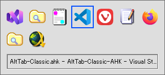

# AltTab-Classic-AHK



A lightweight classic-style Alt+Tab window switcher for Windows, implemented in **AutoHotkey v2**.

It provides a compact icon-based interface inspired by the classic Windows XP Alt+Tab experience, with keyboard and mouse navigation, customizable appearance, window filtering, custom icon mappings, and multi-monitor support.

---

## Who Is This For?

If you think `Alt+Tab` should switch windows, not turn into a presentation, this project may be for you.

No giant thumbnails. No cinematic experience. Just `Alt+Tab`.

---

## Features

- Classic thumbnail-free Alt+Tab interface with a compact icon grid.
- Full keyboard and mouse navigation, including persistent `Ctrl+Alt+Tab` mode.
- Window filtering and dialog handling for modern Windows applications.
- Customizable layout, colors, icons, and window exclusion rules.
- Multi-monitor aware placement.

---

## Requirements

- Windows 11
- [AutoHotkey v2.0 or later](https://www.autohotkey.com/) (64-bit)

Windows 10 may also work, but has not been tested.

---

## Installation

1. Download the repository as a ZIP archive, or clone it:

   ```bash
   git clone https://github.com/p65536/AltTab-Classic-AHK.git
   ```

2. Run `AltTab-Classic.ahk`.

The script works out of the box using its built-in default settings.

To customize the switcher, copy `sample-config.ahk` to `config.ahk` and edit it as needed.

---

## Updating

If the repository was cloned with Git:

```bash
git pull
```

If it was downloaded manually, replace the existing project files with the latest versions.

`config.ahk` is excluded from Git tracking, so local configuration can be kept separately from the main script and sample configuration.

When new configuration options are added, compare your `config.ahk` with the latest `sample-config.ahk` as needed.

---

## Usage

### Default Controls

#### Opening the Switcher

| Key | Function |
| --- | --- |
| `Alt+Tab` | Open the switcher and select the next window |
| `Shift+Alt+Tab` | Open the switcher and select the previous window |
| `Ctrl+Alt+Tab` | Open the switcher in persistent mode (stays open after releasing `Alt`) |

In normal mode, releasing `Alt` activates the selected window and closes the switcher.

#### While the Switcher Is Open

| Key / Action | Function |
| --- | --- |
| `Tab` | Select the next window |
| `Shift+Tab` | Select the previous window |
| `Left` / `Right` / `Up` / `Down` | Navigate the icon grid |
| `Home` | Select the first window |
| `End` | Select the last window |
| `Enter` / `Space` | Activate the selected window |
| `Esc` | Cancel and close the switcher |
| Mouse hover | Select the icon under the pointer |
| Mouse click | Activate the clicked window |

Arrow keys, `Home`, `End`, `Enter`, `Space`, and `Esc` work regardless of whether modifier keys such as `Ctrl`, `Shift`, or `Alt` are being held while the switcher is active.

---

## Notes

### Elevated Applications

Due to Windows User Interface Privilege Isolation (UIPI), hotkeys may not respond when an application running as administrator is focused.

If you need the hotkeys to work while elevated applications are focused, run `AltTab-Classic.ahk` with administrator privileges as well.

### Virtual Desktops

AltTab Classic only shows windows on the currently active virtual desktop.

It does not follow the Windows setting that controls whether `Alt+Tab` shows windows from other virtual desktops.

---

## Configuration

Copy `sample-config.ahk` to `config.ahk` to customize the switcher.

Configuration options include:

- Layout and appearance
- Custom icon mappings
- Window exclusion rules

See [`sample-config.ahk`](sample-config.ahk) for available options, matching rules, and examples.

---

## Credits & Acknowledgements

This project is a new AutoHotkey v2 implementation inspired by [Classic Alt Tab (Reincarnation)](https://www.elevenforum.com/t/classic-alt-tab-reincarnation.35668/), an AutoHotkey v1 script shared on ElevenForum.

---

## License

This project is licensed under the [MIT License](LICENSE).

---

## Author

[p65536](https://github.com/p65536)
